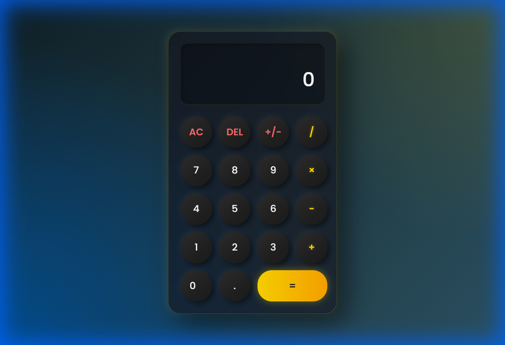

# Modern Calculator

A premium, glassmorphism-designed calculator with a "Golden Blue" aesthetic.

## Features
-   **Premium Design**: Deep blue/gold gradient background with glassmorphism effects.
-   **Golden Theme**: Gold accents for operators and a distinctive gold gradient Equal button.
-   **Responsive Layout**: 5x4 Grid layout.
-   **Functionality**:
    -   Basic Arithmetic (+, -, *, /)
    -   Negate (+/-)
    -   Backspace (DEL)
    -   Clear All (AC)

## Live Demo
[View My Work](https://patel-bhavik2306005.github.io/Morden-Calculator/)

## Tech Stack
-   HTML5
-   CSS3 (Flexbox & Grid)
-   JavaScript (Vanilla)
